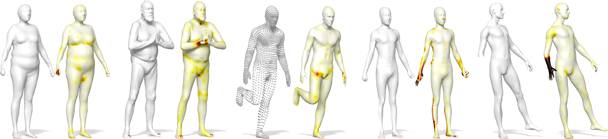

# FARM
Marin, R. and Melzi, S. and Rodolà, E. and Castellani, U., FARM: Functional Automatic Registration Method for 3D Human Bodies, CGF 2019
[[Project page]](http://profs.scienze.univr.it/~marin/farm/index.html) [[arXiv]](https://arxiv.org/abs/1807.10517)

<p align="center">

  
## Contents
* [Quick-start](https://github.com/riccardomarin/FARM#Quick-start)
* [Requirements](https://github.com/riccardomarin/FARM#requirements)
* [Citation](https://github.com/riccardomarin/FARM#citation)
* [License](https://github.com/riccardomarin/FARM#license)
* [Acknowledgements](https://github.com/riccardomarin/FARM#acknowledgements)

## Quick-start
The code runs over all meshes inside "Testset" directory. 

To run the whole pipline adjust the paths of Matlab and Python interpreters inside the file: 
```
Pipeline\run_me.bat
```
and run it.

You can also run each step individually, following this order:
```
First_round.m
Local_patch.m
Fitting_1.py
Second_round.m
Fitting_2.py
ARAP.m
```

We provide two example to verify the setup is done correctly.
The output is stored in the directory:

```
Results\ARAP
```

Other directories contain results after each steps and other useful computations (e.g. FMAP correspondence, landmarks, hands and head patches).

## Requirements
This code is tested over Windows 10 64bit w\ Matlab 2017a and above, and Python 2.7 (but parsing to 3 should be easy). 
All necessary files are already conteined inside this repository.

Several pieces of this pipeline come from third parts contributions; in particular we would list the following credits:
* SMPL model: http://smpl.is.tue.mpg.de
* File readers and ARAP implementation: https://github.com/alecjacobson/gptoolbox
* Functional Maps frameworks (w\ commutativity): http://www.lix.polytechnique.fr/~maks/publications.html
* Open3d python library: http://www.open3d.org/
* MeshFix: https://github.com/MarcoAttene/MeshFix-V2.1
* Remesh (Qslim): http://tosca.cs.technion.ac.il
* Discrete Time Evolution Process (DEP) for landmarks: https://sites.google.com/site/melzismn/publications
* FLANN: https://www.cs.ubc.ca/research/flann/
* Coherent Point Drift (CPD): https://sites.google.com/site/myronenko/research/cpd

Finally, some Matlab ToolBoxes are required (e.g. Symbolic, Parallel Computing).

## Citation
If you use this code, please cite the following:
```
@article{doi:10.1111/cgf.13751,
author = {Marin, R. and Melzi, S. and Rodolà, E. and Castellani, U.},
title = {FARM: Functional Automatic Registration Method for 3D Human Bodies},
journal = {Computer Graphics Forum},
doi = {10.1111/cgf.13751},
url = {https://onlinelibrary.wiley.com/doi/abs/10.1111/cgf.13751},
}
```

## License
Please check the license terms (also of third parts software) before downloading and/or using the code, the models and the data. 
All code and results obtained from it not already covered by other licenses has to be intendend only for non-commercial scientific research purposes.
Any other use, in particular any use for commercial purposes, is prohibited. This includes, without limitation, incorporation in a commercial product, use in a commercial service, or production of other artefacts for commercial purposes including, for example, 3D models, movies, or video games. 
